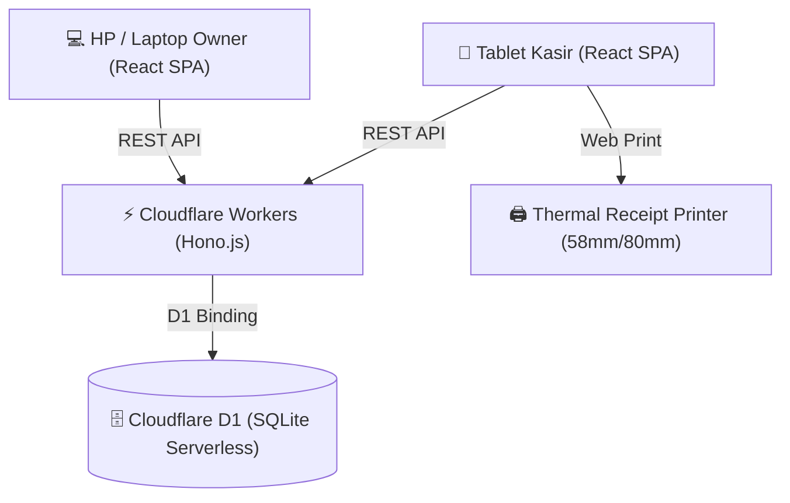

# PRODUCT REQUIREMENT DOCUMENT (PRD) & PROJECT SCOPE
## Sistem Kasir (POS) & Monitoring Operasional Warkop Sudut Temu (SUTE)

---

### 1. INFORMASI PROYEK
* **Nama Proyek:** Sistem Kasir (POS) & Monitoring Warkop Sudut Temu
* **Klien:** Pak Eman (Owner Warkop Sudut Temu)
* **Pengembang:** Bian (Fullstack Developer)
* **Estimasi Waktu:** 1 – 2 Minggu
* **Infrastruktur Target:** Cloudflare Workers + Cloudflare D1 (Edge Serverless SQLite)

---

### 2. LATAR BELAKANG & TUJUAN
Warkop Sudut Temu sebelumnya menggunakan aplikasi kasir pihak ketiga (**Majoo**). Namun, terdapat kebijakan potongan biaya transaksi sebesar **2%** dari setiap transaksi, yang membebani operasional warkop (potongan mencapai ~Rp400.000/bulan untuk omzet Rp20 juta).

**Tujuan Utama:**
1. **0% Potongan Transaksi:** Menggantikan Majoo dengan sistem kasir mandiri tanpa biaya komisi/potongan transaksi sepeser pun.
2. **Efisiensi Kasir:** Antarmuka layar sentuh (*touch-friendly*) yang responsif dan cepat untuk tablet kasir di meja bar warkop.
3. **Monitoring Owner Real-time:** Memudahkan Pak Eman memantau omzet harian, performa shift kasir, dan menu terlaris langsung dari HP/laptop tanpa harus datang fisik ke warkop setiap saat.
4. **Cetak Struk Thermal:** Kompatibel dengan printer struk thermal bluetooth/USB standar (58mm / 80mm).

---

### 3. USER PERSONA & HAK AKSES
Sistem dirancang secara khusus untuk **2 jenis pengguna**:

| Peran (Role) | Perangkat Utama | Kebutuhan Utama | Metode Akses |
|---|---|---|---|
| **Kasir** | Tablet di meja bar | Input pesanan kilat, hitung kembalian tunai, tampilkan QRIS di layar, cetak struk, buka/tutup shift kas. | PIN Cepat 4-digit (misal: `1234`) |
| **Owner (Pak Eman)** | Smartphone / Laptop | Pantau grafik omzet, audit selisih kas kasir, cek stok & menu terlaris, ubah harga makanan/minuman. | Password Akun Owner |

---

### 4. RUANG LINGKUP FITUR (SCOPE OF WORK)

#### A. In-Scope (Fitur v1.0 yang Dibangun)
1. **Modul Kasir (POS Tablet):**
   * Tampilan katalog produk dengan navigasi kategori cepat (*Kopi, Non Kopi, Makanan, Cemilan*).
   * Keranjang pesanan dinamis (*quantity +/-*, hapus item, tambah catatan khusus: *less sugar, es dipisah, pedas sedang*).
   * Tipe pesanan: *Dine-in* (Makan di tempat) & *Takeaway* (Bungkus), nomor meja opsional.
2. **Modul Pembayaran:**
   * **Tunai (Cash):** Tombol pecahan uang instan (Uang Pas, 10k, 20k, 50k, 100k) + kalkulator kembalian otomatis.
   * **QRIS Statis:** Menampilkan gambar QRIS resmi Warkop Sudut Temu (`NMID: ID1026568944999`) langsung di layar tablet kasir saat pelanggan memilih metode QRIS. Kasir tinggal klik konfirmasi setelah pembeli selesai scan.
3. **Modul Cetak Struk:**
   * Desain struk thermal 58mm / 80mm standar struk warkop.
   * Mencantumkan nama toko (Warkop Sudut Temu), nomor order, daftar item, total, metode bayar, dan ucapan terima kasih.
4. **Modul Manajemen Shift Kasir (Audit Laci Kas):**
   * Input kas awal (modal uang receh/kembalian di laci saat buka shift).
   * Rekap otomatis uang masuk tunai vs QRIS selama shift berjalan.
   * Input uang fisik saat tutup shift untuk mendeteksi selisih uang kas (*cash reconciliation*).
5. **Modul Monitoring & Dashboard Owner:**
   * Ringkasan KPI: Omzet hari ini, jumlah transaksi hari ini, rata-rata transaksi (*ticket size*).
   * Grafik tren penjualan mingguan/bulanan.
   * Tabel menu paling laku (*Best Sellers*).
   * Riwayat transaksi lengkap dengan filter tanggal dan metode bayar.
6. **Modul Manajemen Menu (Owner Only):**
   * Tambah menu baru, edit nama, harga jual, dan harga modal (HPP).
   * Toggle ketersediaan menu (bisa dimatikan jika bahan habis/kosong).

#### B. Out-of-Scope (Tidak Termasuk di v1.0)
* Integrasi Payment Gateway Dinamis otomatis (Midtrans/Xendit) — dihindari atas kesepakatan agar tidak terkena potongan fee dan verifikasi KYC.
* Sistem inventaris gramasi bahan mentah kompleks (stok biji kopi per gram).
* Fitur pesan meja online oleh pelanggan (*self-ordering*).

---

### 5. ARSITEKTUR TEKNIS & TECH STACK

* **Frontend:** React 19 + TypeScript + Vite + Tailwind CSS v4 + Lucide Icons.
* **Backend:** Hono.js (Web Standard Fetch API, ultra-lightweight, 0 cold start).
* **Database:** Cloudflare D1 (Serverless SQLite di edge Cloudflare).
* **Hosting:** Cloudflare Pages / Workers (Gratis di Free Tier, kapasitas hingga jutaan request).

---

### 6. STRUKTUR DATA (DATABASE SCHEMA)
* **`users`:** Akun kasir dan owner (id, username, pin/password, name, role).
* **`categories`:** Kategori menu (Kopi, Non-kopi, Makanan, Cemilan).
* **`products`:** Data item warkop (id, category_id, name, price, cost_price, is_available, is_favorite).
* **`shifts`:** Sesi kerja kasir (id, cashier_id, start_time, end_time, initial_cash, total_cash_sales, total_qris_sales, actual_cash_counted, status).
* **`orders`:** Transaksi penjualan (id, order_number, shift_id, cashier_id, customer_name, order_type, table_number, payment_method, total_amount, cash_tendered, change_amount, status, created_at).
* **`order_items`:** Rincian item per transaksi (id, order_id, product_id, product_name, price, quantity, subtotal, notes).

---

### 7. TIMELINE & RENCANA KERJA (1 - 2 MINGGU)

| Fase | Durasi | Target Capaian |
|---|---|---|
| **Fase 1: Setup & Data Foundation** | Hari 1 - 3 | Inisialisasi Vite + Hono + D1, migrasi skema tabel, input menu warkop awal. |
| **Fase 2: Layar Kasir & Transaksi** | Hari 4 - 7 | UI Tablet Kasir, keranjang, hitung kembalian, popup QRIS statis warkop, cetak struk. |
| **Fase 3: Shift Kasir & Dashboard Owner**| Hari 8 - 10 | Fitur buka/tutup shift kasir, dashboard monitoring omzet & grafik, manajemen harga menu. |
| **Fase 4: Testing & Demo Klien** | Hari 11 - 12 | Uji coba di browser tablet kasir, simulasi cetak struk printer, demo perdana ke Pak Eman. |
| **Fase 5: Deployment & Handover** | Hari 13 - 14 | Deploy ke Cloudflare Workers produksi, panduan penggunaan singkat untuk kasir & owner. |

---

### 8. INDIKATOR KEBERHASILAN (SUCCESS METRICS)
1. **0% Transaction Cost:** Tidak ada potongan biaya 2% lagi bagi warkop.
2. **Speed:** Proses input 1 transaksi kasir selesai dalam waktu < 15 detik.
3. **Akurasi Kas:** Tidak ada lagi selisih uang kas harian berkat fitur buka/tutup shift.
4. **Mobilitas:** Pak Eman bisa melihat omzet warkop kapan pun dari HP secara real-time.
